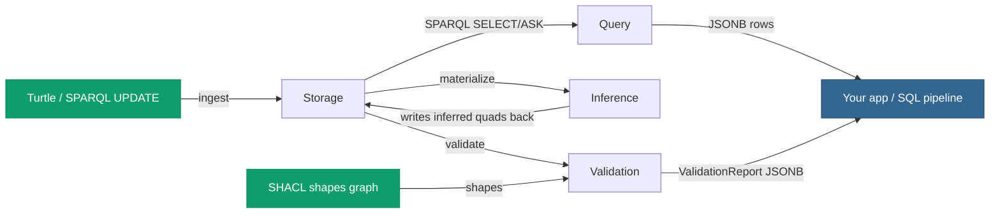

# The four pillars at a glance

pgRDF is one Postgres extension exposing four pillars under the
`pgrdf.*` schema. Each pillar is a real engine, not a stub. They
compose — the same `graph_id` you load Turtle into is the one you
SPARQL-query, the one you materialize, and the one you validate.



| Pillar | What it gives you | Entry-point UDFs |
|---|---|---|
| **[1 · Semantic storage](/v0.4/storage/)** | RDF triples land in dictionary-encoded, partitioned Postgres tables you can `SELECT` from with vanilla SQL. Turtle in, quads out. | `pgrdf.load_turtle`, `pgrdf.parse_turtle`, `pgrdf.add_graph`, `pgrdf.count_quads` |
| **[2 · Semantic query](/v0.4/query/)** | SPARQL 1.1 SELECT/ASK over those triples — multi-pattern joins, FILTER, OPTIONAL, UNION, MINUS, aggregates, BIND, GRAPH. Returns JSONB rows you can join with regular SQL. | `pgrdf.sparql`, `pgrdf.sparql_parse` |
| **[3 · Semantic materialization](/v0.4/inference/)** | OWL 2 RL forward-chaining inference. Implicit consequences (subclass, subproperty, equivalence, inverse, transitive) are written back into the same tables as queryable rows. | `pgrdf.materialize` |
| **[4 · Semantic validation](/v0.4/validation/)** | SHACL Core constraint checking. A graph + a shapes graph produce a W3C-shape `sh:ValidationReport` JSONB you can persist, alert on, or gate ingestion with. | `pgrdf.validate` |

## Anatomy of a single workflow

A typical pgRDF session uses all four pillars in sequence:

```sql
-- 1. Storage — load the data + shapes graphs.
SELECT pgrdf.load_turtle('/data/orders-2026-Q1.ttl', 100);
SELECT pgrdf.load_turtle('/shapes/order-shape.ttl',  200);

-- 2. Inference — materialize OWL 2 RL closures on the data graph.
SELECT pgrdf.materialize(100);

-- 3. Validation — check the data graph (now including inferences)
--    against the shapes graph.
SELECT pgrdf.validate(100, 200);

-- 4. Query — pull whatever subset of the graph your app needs.
SELECT * FROM pgrdf.sparql(
  'PREFIX ex: <http://example.com/>
   SELECT ?order ?customer ?total
     WHERE { ?order a ex:Order ;
                    ex:placedBy ?customer ;
                    ex:total    ?total
             FILTER(?total > 1000) }');
```

[**Continue — Pillar 1 · Semantic storage →**](/v0.4/storage/)
