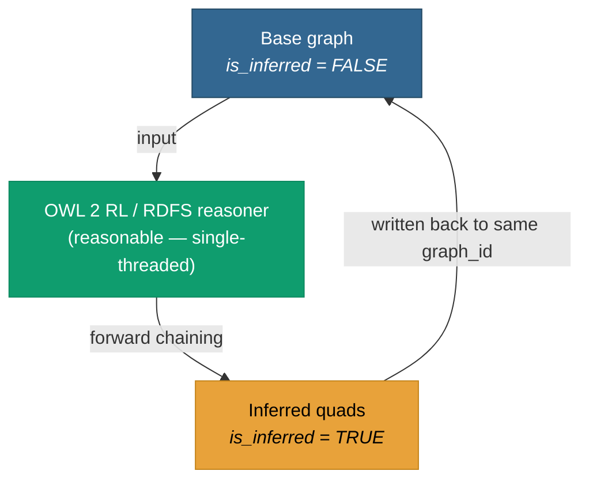

# The mental model

You loaded an ontology + some assertions. Behind every assertion
there is a **chain of entailments** — subclass closures, subproperty
closures, equivalence cycles, inverse-property completions,
transitive-property propagations, individual-equality unfoldings.

`pgrdf.materialize(graph_id)` writes that chain back into the graph as
real rows. Each entailed quad has `is_inferred = TRUE`. Each base quad
has `is_inferred = FALSE` (the default).



After materialization, SPARQL queries against the graph see both the
base **and** the inferred quads as a single, flat triple-set. Your
application doesn't need to know which is which — but operator queries
can filter by `is_inferred` to inspect the breakdown.

## What changes after a materialize call

| Before | After `pgrdf.materialize(g)` |
|---|---|
| `?s a ex:Engineer`, `ex:Engineer ⊑ ex:Person`, `ex:Person ⊑ ex:Agent` | The two transitive type assertions are now present as rows: `?s a ex:Person`, `?s a ex:Agent` |
| `?a ex:knows ?b`, `ex:knows owl:inverseOf ex:knownBy` | The inverse `?b ex:knownBy ?a` is now present as a row |
| `ex:eq owl:sameAs ?a`, `?a ex:prop ?x` | `ex:eq ex:prop ?x` is now present (sameAs propagation) |

## The return value

`pgrdf.materialize` returns a JSONB summary:

```json
{
  "base_triples":              3,
  "inferred_triples_written":  11,
  "previous_inferred_dropped": 0,
  "profile":                   "owl-rl",
  "reasoner_errors":           [],
  "elapsed_ms":                42.1
}
```

`base_triples` is the count of `is_inferred = FALSE` quads passed to
the reasoner; `inferred_triples_written` is the set-difference between
the reasoner's closure and that input — the entailed-but-not-asserted
triples written this call. `previous_inferred_dropped` is the number of
`is_inferred = TRUE` rows wiped before this run (= the previous run's
`inferred_triples_written` on a back-to-back call). `profile` echoes
the requested rule set. Both `base_triples = 0` and
`inferred_triples_written = 0` are valid for an empty graph; the call
is still safe.

## Cost shape — and why size matters

Materialization is **forward-chaining**: the reasoner computes all
entailments up front, in memory, then writes the difference back as a
batched bulk insert. The runtime is dominated by the size of the
inferred set, not the base set. Large ontologies with deep subclass
hierarchies inflate cost.

The reasoner is **in-process, single-threaded, and CPU-bound** — an
upstream limit tracked in
[#1](https://github.com/styk-tv/pgRDF/issues/1). So while
[ingest scales to billions of triples](/v0.6/storage/staged-loader),
**reasoning runs on a graph sized to your hardware**, not the
billion-scale graph. Going forward, the model is to materialize over a
**carved slice** of a larger graph — see the [roadmap](/v0.6/roadmap/).
The proven regime is set out in [Scale of reasoning](/v0.6/inference/scale).

The call holds the partition's row set for the duration. Plan
materialization runs as part of off-hours batch ingestion, not inside
an interactive request handler.

[**Next — Worked example →**](/v0.6/inference/example)
