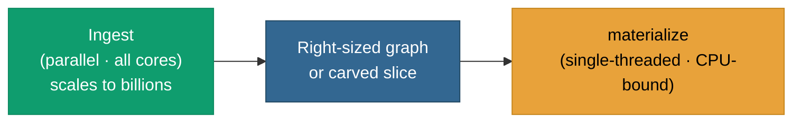

# Scale of reasoning

The two halves of pgRDF scale differently, and the docs say so plainly:

> **Ingest is parallel and scales to billions of triples.
> Reasoning is single-threaded — so you reason over a graph sized to
> your hardware.**

## Why reasoning is single-threaded

`pgrdf.materialize` runs the [`reasonable`](https://github.com/gtfierro/reasonable)
reasoner **in-process, on a single core**. Forward-chaining the OWL 2
RL / RDFS closure to a fixpoint is CPU-bound, and the upstream reasoner
exposes a single-threaded fixpoint — there is no multi-core path to
hand it. This is an **upstream limit, not a pgRDF defect**: it is
tracked openly in [#1](https://github.com/styk-tv/pgRDF/issues/1), with
a parallelism proposal filed upstream as
[`gtfierro/reasonable#57`](https://github.com/gtfierro/reasonable/issues/57).

The consequence for the operating model is direct. The
[native staged bulk loader](/v0.6/storage/staged-loader) ingests the
full **8.2-billion-triple Wikidata `truthy` graph** into a single
PostgreSQL instance — parallel, all-cores, resumable. But
`materialize` is **not** for that graph. Reasoning runs on a graph
your hardware can close in your batch window, and going forward over a
**carved slice** of a larger graph rather than the whole of it
([roadmap](/v0.6/roadmap/)).

## The proven reasoning regime

Two reference points bound what "right-sized" means in practice. Both
are correctness-gated against the known
[LUBM](https://swat.cse.lehigh.edu/projects/lubm/) answer counts.

### LUBM-100 on a laptop — zero tuning

The full LUBM-100 benchmark (100 universities, 14 reference queries)
runs on ordinary hardware with **no database tuning at all**:

| Measured | Result |
|---|---|
| Load 13,879,970 triples (Turtle) | **3 min 29 s** |
| OWL 2 RL reasoning → 22.5M facts, statistics refreshed automatically | **4 min 54 s** |
| All 14 queries on the loaded graph | **each ≤ 3 s** |
| All 14 queries after reasoning | **each ≤ 5 s** |

Environment: a laptop — Apple-silicon VM (8 vCPU / 32 GiB), stock
`postgres:17.4-bookworm` in Docker, **default PostgreSQL
configuration**. No manual indexes, no `ANALYZE`, no planner hints, no
extension settings.

### LUBM-500 on a single box — a 112-million-quad closure

The same load → index → OWL-RL materialize → SPARQL cycle runs across
the full LUBM ladder on one 32-vCPU / 256 GiB box (native PostgreSQL
17, no sharding):

| LUBM-N | base triples | materialize (OWL-RL) | total quads (closure) |
|---|---|---|---|
| 10  | 1.32M | 15s     | 2.13M |
| 100 | 13.9M | 4m 37s  | 22.46M |
| 250 | 34.5M | 10m 9s  | 55.88M |
| 500 | 69.1M | ~43m    | **111.83M** |

LUBM-500 builds a full materialized closure of **111.8 million quads**
on a single box (peak 146 / 256 GiB RAM) — load, reason, and query in
one PostgreSQL instance. The materialize column is the dominant cost at
scale precisely because it is the single-threaded step; ingest and
index scale with cores, reasoning does not.

## How to right-size your reasoning

- **Reason over a slice, not the firehose.** Materialize the graph (or
  the [carved slice](/v0.6/roadmap/)) your batch window can close, then
  SPARQL-query the inferred + base rows flat.
- **Bound the rule set.** The [`'rdfs'` profile](/v0.6/inference/profile-selector)
  computes only the schema closures and is cheaper than full OWL 2 RL
  when your workload doesn't need the equivalence / inverse /
  transitive / sameAs rules.
- **Run off-hours, idempotently.** `materialize` is
  [idempotent](/v0.6/inference/idempotence) and refreshes planner
  statistics on write-back, so it slots into a nightly cron or an
  ingest-tail trigger with no special-casing.

## See also

- [Mental model](/v0.6/inference/mental-model) — the cost shape of
  forward chaining.
- [Reasoning profile selector](/v0.6/inference/profile-selector) —
  trimming the rule set to bound cost.
- [Native staged bulk loader](/v0.6/storage/staged-loader) — the
  parallel ingest path that scales to billions.
- [Roadmap](/v0.6/roadmap/) — the carved-slice direction and the
  upstream parallel-reasoner gate.
