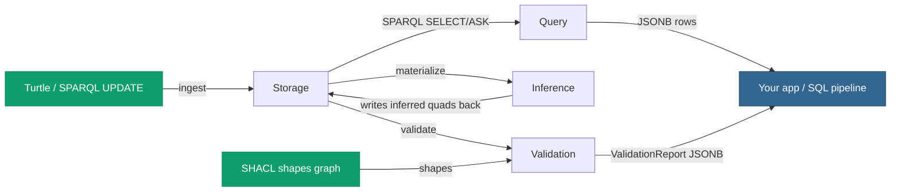

# The four pillars at a glance

pgRDF is one Postgres extension exposing four pillars under the
`pgrdf.*` schema. They compose — the same `graph_id` you load Turtle
into is the one you SPARQL-query, the one you materialize, and the one
you validate.



| Pillar | What it gives you | Entry-point UDFs |
|---|---|---|
| **[1 · Semantic storage](/v0.6/storage/)** | RDF triples land in dictionary-encoded, partitioned Postgres tables you can `SELECT` from with vanilla SQL. Turtle in, quads out. v0.6 adds the [native staged bulk loader](/v0.6/storage/staged-loader). | `pgrdf.load_turtle`, `pgrdf.load_turtle_staged_run`, `pgrdf.parse_turtle`, `pgrdf.add_graph`, `pgrdf.count_quads` |
| **[2 · Semantic query](/v0.6/query/)** | Full SPARQL 1.1 — SELECT / ASK / CONSTRUCT / DESCRIBE / UPDATE over those triples: multi-pattern joins, FILTER, OPTIONAL, UNION, MINUS, aggregates (incl. over UNION), BIND, VALUES, type-aware ORDER BY, GRAPH, property paths. Returns JSONB rows you can join with regular SQL. | `pgrdf.sparql`, `pgrdf.construct`, `pgrdf.describe`, `pgrdf.sparql_parse` |
| **[3 · Semantic materialization](/v0.6/inference/)** | OWL 2 RL **and** RDFS forward-chaining inference (per-call `profile` selector). Implicit consequences (subclass, subproperty, equivalence, inverse, transitive) are written back into the same tables as queryable rows. | `pgrdf.materialize` |
| **[4 · Semantic validation](/v0.6/validation/)** | Native SHACL Core constraint checking — W3C SHACL Core 25/25. A graph + a shapes graph produce a W3C-shape `sh:ValidationReport` JSONB you can persist, alert on, or gate ingestion with. | `pgrdf.validate` |

## The operating model

The four pillars split cleanly along one axis: **how they scale**.

- **Ingest is parallel and scales with the box.** [Storage](/v0.6/storage/)
  — and especially the [staged bulk loader](/v0.6/storage/staged-loader)
  — fans across a background-worker pool. Add cores and the load goes
  faster: the staged loader takes the full 8.2-billion-triple Wikidata
  `truthy` graph end to end (see [Scale](/v0.6/scale/)).
- **Reasoning is single-threaded and sized to fit.**
  [Materialization](/v0.6/inference/) and [validation](/v0.6/validation/)
  run on one backend. The pattern, then, is: ingest the full graph in
  parallel, carve out a right-sized slice, and reason over that slice on
  the box you have. See [Processes & flows](/v0.6/process/) for the
  composable verb chains, and [Roadmap](/v0.6/roadmap/) for the carving
  surface landing across the v0.6.n line.

## Anatomy of a single workflow

A typical pgRDF session uses all four pillars in sequence:

```sql
-- 1. Storage — load the data + shapes graphs.
SELECT pgrdf.load_turtle('/data/orders-2026-Q1.ttl', 100);
SELECT pgrdf.load_turtle('/shapes/order-shape.ttl',  200);

-- 2. Inference — materialize OWL 2 RL closures on the data graph.
SELECT pgrdf.materialize(100);

-- 3. Validation — check the data graph (now including inferences)
--    against the shapes graph.
SELECT pgrdf.validate(100, 200);

-- 4. Query — pull whatever subset of the graph your app needs.
SELECT * FROM pgrdf.sparql(
  'PREFIX ex: <http://example.com/>
   SELECT ?order ?customer ?total
     WHERE { ?order a ex:Order ;
                    ex:placedBy ?customer ;
                    ex:total    ?total
             FILTER(?total > 1000) }');
```

[**Continue — Pillar 1 · Semantic storage →**](/v0.6/storage/)
