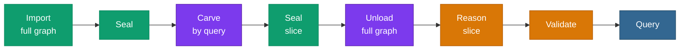

# <span class="material-symbols-outlined icon-blue">account_tree</span>Processes & flows

> pgRDF's operating model is a set of **composable verbs** you chain
> with arrows. Some verbs are parallel and scale with the box; others
> are single-threaded and want a graph sized to your hardware. The
> chains below show how to combine them.

## Two kinds of process

Every verb falls into one of two classes, split by **how it scales**:

| Class | Verbs | Scaling |
|---|---|---|
| **Parallel / scales with the box** | **Import**, **Seal** (concurrent index build) | Fans across a background-worker pool. Add cores → goes faster. Proven on the [full 8.2 B graph](/v0.6/scale/). |
| **Single-threaded / sized-to-fit** | **Reason**, **Validate** | Runs on one backend. The graph must be sized to fit your hardware — you do not reason over the full source graph. |

This is the constraint that shapes every chain:
**ingest is parallel, reasoning is not.** So the move at scale is to
ingest the full graph in parallel, then carve a right-sized slice and
reason over *that*.

## The basic chains

The simplest pipelines need no carving — ingest, seal the indexes,
query:

```
Import → Seal → Query
```


When the workload includes inference and validation on a graph that
already fits your box:

```
Import → Seal → Reason → Validate → Query
```


The green verbs scale with the box; the amber verbs are
single-threaded.

## The key chain — scale meets hardware

When the source graph is larger than what a single backend can reason
over, ingest it in parallel anyway, then **carve** the slice you
actually need to reason on, seal that slice, unload the rest, and
reason over the carved graph:

```
Import(full graph) → Seal → Carve(query) → Seal(slice) → Unload(full graph) → Reason(slice) → Validate → Query
```



Read this as **scale meets hardware**:

- **Import(full graph)** and the seals are parallel — they scale to
  whatever box you have, all the way up to the
  [8.2-billion-triple ceiling](/v0.6/scale/).
- **Carve(query)** cuts a query-defined slice out of the full graph.
- **Unload(full graph)** parks the full graph so it is not taking up
  the working set while you reason.
- **Reason(slice)** and **Validate** then run single-threaded over a
  graph **sized to your box** — not the entire source graph.

In short: you do not reason over the whole source graph on
ordinary hardware. You ingest it in parallel, carve it down to a slice
that fits, and reason over the slice.

## The verb glossary

| Verb | Class | Status |
|---|---|---|
| **Import** | parallel | Shipped — [staged bulk loader](/v0.6/storage/staged-loader) (`load_turtle`, `load_turtle_staged_run`). |
| **Seal** | parallel | Shipped — the staged loader's concurrent INDEX phase (one worker per DDL). |
| **Query** | — | Shipped — full [SPARQL 1.1 surface](/v0.6/query/). |
| **Reason** | single-threaded | Shipped — [OWL 2 RL + RDFS materialization](/v0.6/inference/). |
| **Validate** | single-threaded | Shipped — [SHACL Core 25/25](/v0.6/validation/). |
| **Carve(query)** | parallel | Roadmap — see [Roadmap](/v0.6/roadmap/) (C1/C2). |
| **Unload / park** | — | Roadmap — see [Roadmap](/v0.6/roadmap/) (C4). |

`Carve` and `Unload` are the verbs the v0.6.n line is building toward
the [v0.7.0 graduation](/v0.6/roadmap/); the import-side and the
reasoning-side verbs are all shipped on v0.6.14 today.

## See also

<div class="icon-bullets">

- <span class="material-symbols-outlined">query_stats</span> [**Scale & benchmarks**](/v0.6/scale/) — the parallel-ingest ceiling these chains build on.
- <span class="material-symbols-outlined">rocket_launch</span> [**Roadmap**](/v0.6/roadmap/) — the carve / re-encode / park-graph lifecycle landing across v0.6.n.
- <span class="material-symbols-outlined">layers_clear</span> [**The four pillars**](/v0.6/pillars) — the engines the verbs map onto.

</div>
