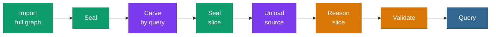

# <span class="material-symbols-outlined icon-blue">hub</span>Pattern — Ingest → Carve → Reason

> The chain for when the source graph is **larger than one backend can
> reason over**. Ingest it all in parallel, carve the slice you
> actually need, park the rest, and reason over the right-sized slice.
> This is **scale meets hardware**.



Green is parallel and shipped; amber is single-threaded and shipped;
**purple is the carve waist — on the [roadmap](/v0.6/roadmap/)**.

## When to use it

The source graph exceeds what a single backend can close over — up to
the [8.2-billion-triple](/v0.6/scale/) extreme. You still ingest it in
full (that scales), but you do **not** reason over the whole thing.

## Reading the chain

| Position | Verb | Status |
|---|---|---|
| Head | [Import](/v0.6/process/import) + [Seal](/v0.6/process/seal) (full graph) | **Shipped** — scales to 8.2 B |
| Waist | [Carve](/v0.6/process/carve) (slice) + Seal (slice) + [Unload](/v0.6/process/unload) (source) | **Roadmap** — C1/C2/C4; manual path today |
| Tail | [Reason](/v0.6/process/reason) → [Validate](/v0.6/process/validate) → [Query](/v0.6/process/query) (slice) | **Shipped** — single-threaded, over the sized slice |

## A worked scenario — reason over a neighborhood

You have a large source graph and want to reason only over the
neighborhood of one seed entity. Each step below is a **shipped**
primitive; the one-call [Carve](/v0.6/process/carve) /
[Unload](/v0.6/process/unload) verbs that will fold the waist together
are the [roadmap](/v0.6/roadmap/) (C1–C4).

### Head — ingest the full source (shipped, scales to 8.2 B)

```sql
SELECT pgrdf.add_graph(1);
SELECT pgrdf.load_turtle_staged_run('/data/source.nt', 1, 0);
--  → {"ok": true, "quads": ..., "phase_ms": { ... }}
```

The staged loader fans across the worker pool — this is the half that
scales, proven on the [full 8.2 B graph](/v0.6/scale/).

### Waist (manual today) — carve the slice, park the source

[`construct`](/v0.6/query/construct) the neighborhood you need and
reload it into a fresh, small graph with its own dictionary:

```sql
-- carve: a query-defined slice → /tmp/slice.nt
SELECT pgrdf.construct(
  'PREFIX ex: <http://example.org/>
   CONSTRUCT { ?s ?p ?o }
   WHERE { ex:seed (ex:related){1,2} ?s . ?s ?p ?o }');

-- reload the slice (fresh small dictionary), then park the source
SELECT pgrdf.add_graph(900);
SELECT pgrdf.load_turtle_staged_run('/tmp/slice.nt', 900, 0);
ALTER TABLE pgrdf._pgrdf_quads DETACH PARTITION pgrdf._pgrdf_quads_g1;  -- park the source
```

`CONSTRUCT`, the staged loader, and partition `DETACH` are each
covered in the [test suite](https://github.com/styk-tv/pgRDF/tree/main/tests);
the [one-call verbs](/v0.6/roadmap/) will replace this hand-assembly
and re-encode the slice in place.

### Tail — reason and validate the right-sized slice (shipped)

```sql
SELECT pgrdf.materialize(900, 'owl-rl');   -- single-threaded, but over the small slice
SELECT pgrdf.validate(900, 901);
```

Reasoning now runs over a graph **sized to your box**, not the full
source — see [Load → Reason → Query](/v0.6/process/pattern-reason) for
the reasoning step on its own.

## On v0.6.14 today

The head and tail are shipped and verified; the **waist** — the
one-call [`Carve`](/v0.6/process/carve) and [`Unload`](/v0.6/process/unload)
verbs — is the [carving line on the roadmap](/v0.6/roadmap/) (C1–C4,
v0.6.15–v0.6.18). The manual path above runs on v0.6.14 today.

## See also

- [Roadmap](/v0.6/roadmap/) — the carving line (C1–C6) toward v0.7.0.
- [Carve](/v0.6/process/carve) · [Unload](/v0.6/process/unload) — the roadmap verbs.
- [Scale & benchmarks](/v0.6/scale/) — the parallel-ingest ceiling the head builds on.
