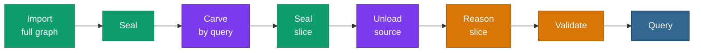

# <span class="material-symbols-outlined icon-blue">hub</span>Pattern — Ingest → Carve → Reason

> The chain for when the source graph is **larger than one backend can
> reason over**. Ingest it all in parallel, carve the slice you
> actually need, park the rest, and reason over the right-sized slice.
> This is **scale meets hardware**.



Green is parallel and shipped; amber is single-threaded and shipped;
**purple is the carve waist — on the [roadmap](/v0.6/roadmap/)**.

## When to use it

The source graph exceeds what a single backend can close over — up to
the [8.2-billion-triple](/v0.6/scale/) extreme. You still ingest it in
full (that scales), but you do **not** reason over the whole thing.

## Reading the chain

| Position | Verb | Status |
|---|---|---|
| Head | [Import](/v0.6/process/import) + [Seal](/v0.6/process/seal) (full graph) | **Shipped** — scales to 8.2 B |
| Waist | [Carve](/v0.6/process/carve) (slice) + Seal (slice) + [Unload](/v0.6/process/unload) (source) | **Roadmap** — C1/C2/C4; manual path today |
| Tail | [Reason](/v0.6/process/reason) → [Validate](/v0.6/process/validate) → [Query](/v0.6/process/query) (slice) | **Shipped** — single-threaded, over the sized slice |

## On v0.6.14 today

The head and tail are shipped. The **waist** — the one-call
[`Carve`](/v0.6/process/carve) and [`Unload`](/v0.6/process/unload)
verbs — is the [carving line on the roadmap](/v0.6/roadmap/) (C1–C4,
v0.6.15–v0.6.18). Until it lands you can run the waist by hand:
[`construct`](/v0.6/query/construct) the slice and reload it into a
fresh graph (see [Carve](/v0.6/process/carve)), then
[`DETACH PARTITION`](/v0.6/storage/graph-partitions) the source (see
[Unload](/v0.6/process/unload)).

```sql
-- Head: ingest the full source in parallel (shipped, scales to 8.2 B)
SELECT pgrdf.add_graph(1);
SELECT pgrdf.load_turtle_staged_run('/data/source.nt', 1, 0);

-- Waist (manual today): CONSTRUCT the slice → reload into a fresh small graph
SELECT pgrdf.construct('CONSTRUCT { ?s ?p ?o } WHERE { <seed> (<rel>){1,2} ?s . ?s ?p ?o }');
SELECT pgrdf.add_graph(900);
SELECT pgrdf.load_turtle_staged_run('/tmp/slice.nt', 900, 0);

-- Tail: reason + validate + query the right-sized slice (shipped)
SELECT pgrdf.materialize(900, 'owl-rl');
SELECT pgrdf.validate(900, 901);
```

## See also

- [Roadmap](/v0.6/roadmap/) — the carving line (C1–C6) toward v0.7.0.
- [Carve](/v0.6/process/carve) · [Unload](/v0.6/process/unload) — the roadmap verbs.
- [Scale & benchmarks](/v0.6/scale/) — the parallel-ingest ceiling the head builds on.
