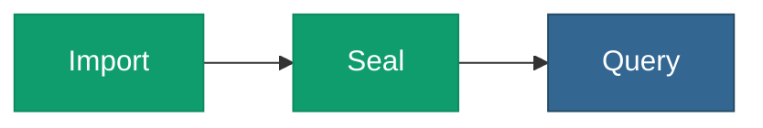

# <span class="material-symbols-outlined icon-blue">search</span>Pattern — Load → Query

> The simplest semantic process: get RDF in and ask questions of it.
> No inference, no validation, no carving — just the
> [head](/v0.6/process/building-a-chain) and the read.



## When to use it

You have RDF and you want to query it with SPARQL — joined, if you
like, with regular SQL. **This pattern works at any scale**, including
the full [8.2-billion-triple graph](/v0.6/scale/): Query is not the
single-threaded constraint, so there is no carve waist here.

## The chain

| Position | Verb | Call |
|---|---|---|
| Head | [Import](/v0.6/process/import) + [Seal](/v0.6/process/seal) | `load_turtle` / `load_turtle_staged_run` |
| Tail | [Query](/v0.6/process/query) | `sparql` / `construct` / `describe` |

```sql
-- Import + Seal (one call; the loader builds the hexastore)
SELECT pgrdf.add_graph(100);
SELECT pgrdf.load_turtle('/fixtures/ontologies/foaf.ttl', 100);

-- Query
SELECT * FROM pgrdf.sparql(
  'PREFIX foaf: <http://xmlns.com/foaf/0.1/>
   SELECT ?p ?n WHERE { ?p foaf:name ?n }');
```

## Next step

Add inference with [Load → Reason → Query](/v0.6/process/pattern-reason),
or a conformance gate with
[Load → Validate → Query](/v0.6/process/pattern-validate).
