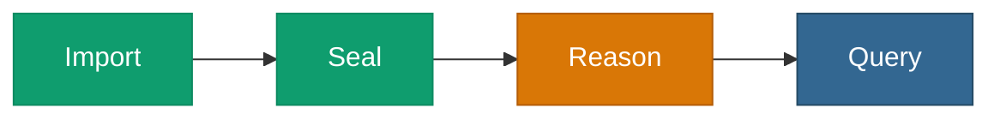

# <span class="material-symbols-outlined icon-orange">psychology</span>Pattern — Load → Reason → Query

> Materialize the implicit consequences of a graph, then query the
> **closure** — so a query sees entailed facts, not just asserted ones.



## When to use it

You need queries to return facts that **follow from** the ontology —
subclass membership, transitive relations, inverses — not only the
triples literally in the file. The amber [Reason](/v0.6/process/reason)
step is **single-threaded**, so the graph must fit your box (if it does
not, use the [carve pattern](/v0.6/process/pattern-carve)).

## A worked scenario — an inverse property

`ex:owns` has an inverse, `ex:ownedBy`. We assert only that Alice owns a
book — never the inverse — and let the reasoner derive it.

### Step 1 — load the data

```sql
SELECT pgrdf.add_graph(104900);
SELECT pgrdf.parse_turtle('
@prefix ex:  <http://example.org/> .
@prefix owl: <http://www.w3.org/2002/07/owl#> .

ex:owns owl:inverseOf ex:ownedBy .
ex:alice ex:owns ex:book .
', 104900);
```

### Step 2 — query *before* reasoning

Ask what Alice owns *by the inverse* — nothing is asserted yet:

```sql
SELECT * FROM pgrdf.sparql(
  'PREFIX ex: <http://example.org/>
   SELECT ?s WHERE { ?s ex:ownedBy ex:alice }');
--  → (no rows)
```

### Step 3 — reason

```sql
SELECT pgrdf.materialize(104900, 'owl-rl');
--  → {"base_triples": 2, "inferred_triples_written": ..., ...}
```

The OWL 2 RL `prp-inv` rule entails `ex:book ex:ownedBy ex:alice` from
`ex:alice ex:owns ex:book` + `ex:owns owl:inverseOf ex:ownedBy`.

### Step 4 — query *after* reasoning

Same query, now answered from the closure:

```json
{"s": "http://example.org/book"}
```

::: tip Grounded in the test suite
This is [`tests/w3c-sparql/49-reasoning-profile-owl-rl`](https://github.com/styk-tv/pgRDF/tree/main/tests/w3c-sparql/49-reasoning-profile-owl-rl).
Its sibling [`48-reasoning-profile-rdfs`](https://github.com/styk-tv/pgRDF/tree/main/tests/w3c-sparql/48-reasoning-profile-rdfs)
shows the contrast: `owl:inverseOf` is an OWL 2 RL rule, **not** an RDFS
rule — so this same triple would **not** be entailed under
`materialize(…, 'rdfs')`. The profile you pick changes the closure.
:::

## Notes

- `materialize` is **idempotent** — re-run it freely; prior inferred rows are dropped and re-derived.
- Pick the profile: `'owl-rl'` (default) or `'rdfs'` — see [Reason](/v0.6/process/reason).

## Next step

Add a conformance gate over the closure with
[Load → Validate → Query](/v0.6/process/pattern-validate), or right-size
a large source with [Ingest → Carve → Reason](/v0.6/process/pattern-carve).
