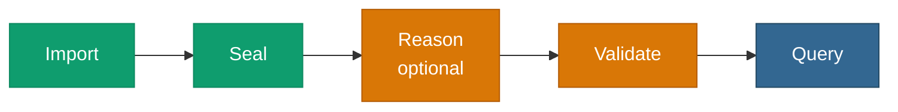

# <span class="material-symbols-outlined icon-blue">verified</span>Pattern — Load → Validate → Query

> Check a graph against SHACL shapes and **act on the verdict** — gate
> ingestion, alert, or only query what conforms.



## When to use it

You want a **conformance gate** — refuse data that violates your
shapes, or surface the violations as data. Put
[Reason](/v0.6/process/reason) before [Validate](/v0.6/process/validate)
when the shapes constrain *entailed* facts (often the case); skip it
when they constrain only asserted triples. Both are single-threaded, so
size the graph to your box.

## The chain

```sql
-- Head: Import the data graph (10) and the shapes graph (11)
SELECT pgrdf.add_graph(10);
SELECT pgrdf.load_turtle('/data/instances.ttl', 10);
SELECT pgrdf.add_graph(11);
SELECT pgrdf.load_turtle('/data/shapes.ttl', 11);

-- Optional: Reason first, so validation sees the closure
SELECT pgrdf.materialize(10, 'owl-rl');

-- Validate: data graph 10 against shapes graph 11
SELECT pgrdf.validate(10, 11);
--  → {"conforms": false, "results": [ ... ]}   ← gate on conforms
```

## Acting on the report

The report is JSONB, so the gate is plain SQL:

```sql
SELECT (pgrdf.validate(10, 11) -> 'conforms')::boolean AS ok;
```

Branch on `ok`, or join `results` to surface violations. See
[Report as data](/v0.6/validation/report-as-data).

## Next step

For a source larger than one backend can hold, carve a slice first:
[Ingest → Carve → Reason](/v0.6/process/pattern-carve), then validate
the slice.
