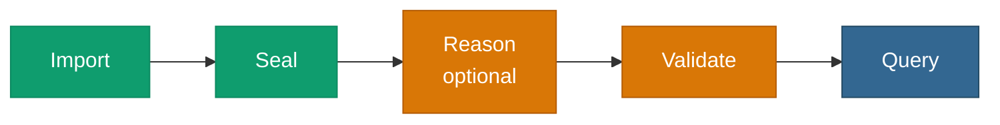

# <span class="material-symbols-outlined icon-blue">verified</span>Pattern — Load → Validate → Query

> Check a graph against SHACL shapes and **act on the verdict** — gate
> ingestion, alert, or only query what conforms. This page walks the
> whole journey on real data, with the real report.



## When to use it

You want a **conformance gate** — refuse data that violates your
shapes, or surface the violations as data. Put
[Reason](/v0.6/process/reason) before [Validate](/v0.6/process/validate)
when the shapes constrain *entailed* facts; skip it when they constrain
only asserted triples. Both are single-threaded, so size the graph to
your box.

## A worked scenario — required fields

A `Person` dataset where one record is incomplete. We require every
person to have **a name and an age**, load two records — one complete,
one missing its age — and watch validation catch exactly the
incomplete one.

### Step 1 — load the data

```sql
SELECT pgrdf.add_graph(8971);
SELECT pgrdf.parse_turtle('
@prefix ex:   <http://example.org/> .
@prefix foaf: <http://xmlns.com/foaf/0.1/> .
@prefix xsd:  <http://www.w3.org/2001/XMLSchema#> .

ex:alice a foaf:Person ; foaf:name "Alice" .                          # no ex:age
ex:bob   a foaf:Person ; foaf:name "Bob" ; ex:age "30"^^xsd:integer .
', 8971);
```

Alice has a name but no age; Bob has both.

### Step 2 — load the shapes

```sql
SELECT pgrdf.add_graph(8972);
SELECT pgrdf.parse_turtle('
@prefix ex:   <http://example.org/> .
@prefix sh:   <http://www.w3.org/ns/shacl#> .
@prefix foaf: <http://xmlns.com/foaf/0.1/> .
@prefix xsd:  <http://www.w3.org/2001/XMLSchema#> .

ex:PersonShape a sh:NodeShape ;
    sh:targetClass foaf:Person ;
    sh:property [ sh:path foaf:name ; sh:minCount 1 ; sh:datatype xsd:string  ] ;
    sh:property [ sh:path ex:age   ; sh:minCount 1 ; sh:datatype xsd:integer ] .
', 8972);
```

Every `foaf:Person` must carry at least one name and one integer age.

### Step 3 — validate

```sql
SELECT pgrdf.validate(8971, 8972);
```

pgRDF returns a W3C `sh:ValidationReport` as JSONB:

```json
{
  "conforms": false,
  "data_graph_id": 8971,
  "shapes_graph_id": 8972,
  "results": [
    {
      "focusNode": "http://example.org/alice",
      "resultPath": "http://example.org/age",
      "resultSeverity": "sh:Violation",
      "sourceConstraintComponent": "sh:MinCountConstraintComponent"
    }
  ]
}
```

### Reading the report

- **`conforms` is `false`** — at least one node violates the shapes.
- **One result, and it is Alice** — on `ex:age`, a `sh:Violation` from
  the `minCount` constraint: she is missing the required age.
- **Bob is absent from `results`** — he conforms, so a gate built on
  this report lets him through and stops Alice.

::: tip Grounded in the test suite
This is [`tests/regression/sql/71-shacl-real.sql`](https://github.com/styk-tv/pgRDF/blob/main/tests/regression/sql/71-shacl-real.sql),
gated in CI: the test asserts `conforms = false`, that Alice **must**
appear as a violating focus node, that Bob **must not**, and that every
result carries `sh:Violation` severity and a `sourceConstraintComponent`.
:::

## Acting on the report

The report is JSONB, so the gate is plain SQL:

```sql
SELECT (pgrdf.validate(8971, 8972) ->> 'conforms')::boolean AS ok;
--  → f
```

Branch on `ok` to accept or reject the load, or unfold the violations
to act on each one:

```sql
SELECT res ->> 'focusNode' AS node,
       res ->> 'resultPath' AS path
FROM jsonb_array_elements(pgrdf.validate(8971, 8972) -> 'results') AS res;
--  → node = http://example.org/alice | path = http://example.org/age
```

See [Report as data](/v0.6/validation/report-as-data) for the full
report shape.

## Variation — validate the entailed graph

When your shapes constrain facts that **follow from** the ontology
(class membership, inverses), [Reason](/v0.6/process/reason) first so
validation sees the closure, not just the asserted triples:

```sql
SELECT pgrdf.materialize(8971, 'owl-rl');   -- entail first
SELECT pgrdf.validate(8971, 8972);          -- then validate the closure
```

This is the amber `Reason → Validate` segment of the chain above.

## Next step

For a source larger than one backend can hold, carve a slice first:
[Ingest → Carve → Reason](/v0.6/process/pattern-carve), then validate
the slice.
